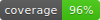
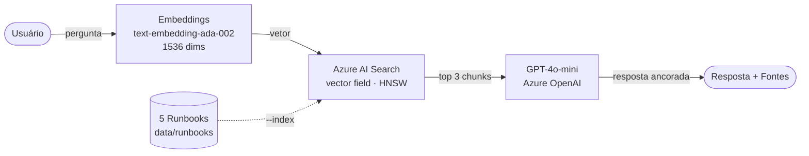

# azure-ai-lab — Azure AI Foundry vs AWS Bedrock

[](https://github.com/leonardodebs/azure-ai-lab/actions/workflows/ci.yml)


**Clouds:**


**Stack:**


Laboratório de IA na **Azure (Azure AI Foundry / Azure OpenAI)** comparado lado a
lado com **AWS Bedrock** e **GCP Vertex AI**, usando os **mesmos prompts de
infraestrutura e as mesmas métricas** dos projetos irmãos `gcp-vertex-ai` e
`rag-runbooks`. Provisionado com **Terraform (azurerm)**, roda no **free trial do
Azure (US$200 de créditos)**, região **eastus**.

> Custo estimado de operação: **~US$2–5/mês** (GPT-4o-mini a US$0,15/1M tokens de
> entrada e US$0,60/1M de saída; Azure AI Search no **free tier F1**).

---

## Arquitetura de RAG



---

## Estrutura

```
azure-openai/
├── scripts/setup_check.py          # verifica CLI, login, providers, conexão OpenAI
├── terraform/                      # azurerm: RG, OpenAI, deployments, Search, Storage, KV
├── src/
│   ├── compare_models.py           # GPT-4o-mini vs Claude Haiku vs Gemini (5 prompts)
│   ├── azure_rag.py                # RAG: AI Search + GPT-4o-mini
│   ├── azure_content_safety.py     # moderação (capacidade única da Azure)
│   ├── semantic_kernel_demo.py     # agente Semantic Kernel (InfraPlugin + RunbookPlugin)
│   └── three_clouds_rag_comparison.py
├── data/runbooks/                  # 5 runbooks de operação (fonte do RAG)
├── tests/                          # pytest — APIs Azure mockadas, sem chamadas reais
└── .github/workflows/ci.yml        # fmt+validate · pytest · checkov
```

---

## Setup e autenticação

```bash
# 1. Autenticar na Azure
az login && az account set --subscription "YOUR_SUBSCRIPTION_ID"

# 2. Registrar os providers (uma vez por assinatura)
az provider register --namespace Microsoft.CognitiveServices
az provider register --namespace Microsoft.MachineLearningServices

# 3. Provisionar a infra
cd terraform
terraform init && terraform plan
terraform apply

# 4. Preencher o .env com os outputs
cp ../.env.example ../.env
terraform output -raw openai_api_key      # → AZURE_OPENAI_API_KEY
terraform output openai_endpoint          # → AZURE_OPENAI_ENDPOINT
terraform output search_endpoint          # → AZURE_SEARCH_ENDPOINT
terraform output -raw search_api_key      # → AZURE_SEARCH_API_KEY

# 5. Verificar a conexão
make check        # → "Azure AI Foundry: OK"
```

### Comandos do Makefile

| Alvo | Descrição |
|------|-----------|
| `make check` | Verifica CLI, login, providers e conexão com o Azure OpenAI |
| `make tf-init` / `tf-plan` / `tf-apply` / `tf-destroy` | Ciclo Terraform |
| `make compare` | Compara GPT-4o-mini vs Claude Haiku vs Gemini |
| `make rag-index` | Cria o índice no AI Search e indexa os runbooks (rodar uma vez) |
| `make rag Q="..."` | Pergunta ao RAG |
| `make safety` | Analisa 10 textos com Content Safety |
| `make sk-demo` | Demo do Semantic Kernel |
| `make compare-3` | Gera o relatório de RAG nas três nuvens |
| `make report` | Gera todos os relatórios |
| `make test` | Roda o pytest (sem chamadas reais) |
| `make coverage` | Mede a cobertura e regenera `docs/coverage.svg` |
| `make serve` | Sobe o dashboard em http://localhost:8000/web/ |

> ⚠️ Rode `make tf-destroy` ao terminar para **não consumir os créditos do trial**.

---

## Dashboard

Dashboard estático (sem backend) em [`web/`](web/) que lê
`reports/azure_comparison.json` ao vivo e renderiza as comparações de modelos,
Content Safety, custo, 15 dimensões e RAG nas 3 nuvens:

```bash
make compare        # gera o JSON (opcional; sem ele cai em aviso amigável)
make serve          # abra http://localhost:8000/web/
```

> Sirva via `http.server` — o protocolo `file://` bloqueia o `fetch` do JSON.

---

## Azure AI Foundry vs AWS Bedrock — 15 dimensões

| # | Dimensão | Azure AI Foundry | AWS Bedrock |
|---|----------|------------------|-------------|
| 1 | Modelos próprios/parceiros | GPT-4o/4o-mini, o-series (OpenAI), Llama, Mistral, Phi | Claude, Llama, Titan, Mistral, Command |
| 2 | Modelo "carro-chefe" | GPT-4o-mini (custo-benefício) | Claude 3.5/Haiku |
| 3 | RAG gerenciado | Azure AI Search + "on your data" | Bedrock Knowledge Bases (OpenSearch Serverless) |
| 4 | Vetor / índice | Azure AI Search (HNSW, híbrido) | OpenSearch Serverless / Aurora pgvector |
| 5 | Agentes | **Semantic Kernel** + Azure AI Agent Service | Bedrock Agents |
| 6 | Fine-tuning | Sim (GPT-4o-mini, GPT-3.5, etc.) | Sim (Titan, Claude via custom models) |
| 7 | Embeddings | text-embedding-ada-002 / 3-small / 3-large | Titan Embeddings v2, Cohere |
| 8 | Content safety / moderação | **Serviço dedicado (Content Safety)** ✅ | Guardrails (acoplado ao modelo) |
| 9 | Pricing GPT-4o-mini | US$0,15/1M in · US$0,60/1M out | (Claude Haiku) US$0,25/1M in · US$1,25/1M out |
| 10 | Free tier | Trial US$200 + AI Search **F1 grátis** | Sem free tier de inferência (paga por uso) |
| 11 | SDK | `openai` (AzureOpenAI), `azure-*`, Semantic Kernel | `boto3` (bedrock-runtime), LangChain |
| 12 | IaC / Terraform | `azurerm` (cognitive_account, _deployment) maduro | `aws` (bedrock_*) mais novo |
| 13 | Identidade / segredos | Entra ID + Key Vault | IAM + Secrets Manager |
| 14 | Enterprise SLA | 99,9% (Cognitive Services S0) | 99,9% (Bedrock) |
| 15 | Multimodal | GPT-4o (texto/visão/áudio) | Claude (texto/visão), Titan Image |

**Leituras-chave:**
- **Content Safety** é uma **capacidade única — sem equivalente direto no Bedrock**
  (o Bedrock oferece Guardrails acoplados ao modelo, não um serviço de
  classificação independente com severidade graduada por categoria).
- **Semantic Kernel** é o **framework de agentes nativo da Azure — aparece com
  frequência em vagas (JDs) de engenharia de IA corporativa**.
- O **free tier F1 do Azure AI Search** torna o RAG quase gratuito em laboratório.

---

## Comparação de RAG nas três nuvens

Gerada por `make compare-3` em [`reports/three_clouds_rag_comparison.md`](reports/three_clouds_rag_comparison.md).
As mesmas 5 perguntas rodam em AWS (FAISS + Claude), GCP (Vertex + Gemini) e Azure
(AI Search + GPT-4o-mini).

| Dimensão | AWS | GCP | Azure |
|----------|-----|-----|-------|
| Vetor | OpenSearch / FAISS | Vertex Vector Search | Azure AI Search (HNSW) |
| Embeddings | Titan v2 (1536) | text-embedding-004 (768) | ada-002 (1536) |
| LLM | Claude 3 Haiku | Gemini 1.5 Flash | GPT-4o-mini |
| RAG gerenciado | Bedrock Knowledge Bases | Vertex RAG Engine | AI Search + on your data |

### Quando escolher cada nuvem para RAG

| Cenário | Escolha | Por quê |
|---------|---------|---------|
| Já é casa AWS, quer mínimo de código | **Bedrock Knowledge Bases** | Ingestão + vetor totalmente gerenciados, integra com S3/IAM |
| Dados no BigQuery / forte em analytics | **GCP Vertex AI** | Gemini com contexto longo barato + data warehouse nativo |
| Stack Microsoft / compliance + moderação | **Azure AI Foundry** | AI Search maduro, Content Safety dedicado, Semantic Kernel |
| Menor custo por token em chat | **Azure (GPT-4o-mini)** / **GCP (Gemini Flash)** | Ambos muito baratos |
| Evitar lock-in | **Pipeline próprio (FAISS)** | Controle total; troca de LLM sem refazer ingestão |

---

## Custos

| Item | Custo |
|------|-------|
| GPT-4o-mini | US$0,15 / 1M tokens (entrada) · US$0,60 / 1M (saída) |
| text-embedding-ada-002 | US$0,10 / 1M tokens |
| Azure AI Search | **Free tier F1** (1 índice, 50 MB) |
| Storage Account (LRS) | centavos/mês no volume do lab |
| **Total estimado** | **~US$2–5/mês** em uso de laboratório |

---

## Skills demonstradas

`Azure OpenAI` · `Azure AI Search` · `RAG vetorial (HNSW)` · `Semantic Kernel` ·
`Azure AI Content Safety` · `Terraform (azurerm)` · `IA multicloud` · `Python` ·
`GitHub Actions`

## Tópicos

`azure` · `azure-openai` · `openai` · `gpt-4o` · `semantic-kernel` · `terraform` ·
`rag` · `vector-search` · `multicloud` · `devops` · `cloud-engineering` · `python`
