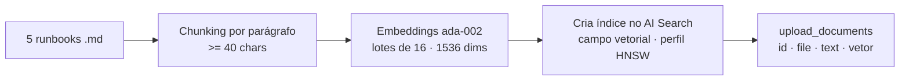
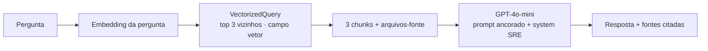

# Documentação de Arquitetura — azure-ai-lab

Detalhes técnicos da arquitetura do laboratório de IA na **Azure AI Foundry
(Azure OpenAI)**, comparado com AWS Bedrock e GCP Vertex AI. Região: **eastus**.

---

## 1. Visão geral

O projeto provisiona, via Terraform, uma stack mínima de IA generativa na Azure e
expõe quatro fluxos de aplicação em Python (comparação de modelos, RAG, moderação
de conteúdo e um agente Semantic Kernel), além de um relatório comparativo entre
as três nuvens.

```mermaid
flowchart TB
    subgraph Infra["Infraestrutura (Terraform · azurerm)"]
        RG[Resource Group<br/>rg-azure-ai-lab-eastus]
        OAI[Azure OpenAI · S0<br/>oai-azure-ai-lab]
        D1[Deployment<br/>gpt-4o-mini · 10K TPM]
        D2[Deployment<br/>text-embedding-ada-002 · 10K TPM]
        SRCH[Azure AI Search · F1<br/>srch-azure-ai-lab]
        ST[Storage Account<br/>stazurailab{random}]
        KV[Key Vault<br/>kv-azure-ai-lab]
        RG --> OAI --> D1
        OAI --> D2
        RG --> SRCH
        RG --> ST
        RG --> KV
        OAI -. chave .-> KV
        SRCH -. chave .-> KV
    end

    subgraph Apps["Aplicações (Python · src/)"]
        CMP[compare_models.py]
        RAG[azure_rag.py]
        CS[azure_content_safety.py]
        SK[semantic_kernel_demo.py]
        TRES[three_clouds_rag_comparison.py]
    end

    D1 --> CMP
    D1 --> RAG
    D2 --> RAG
    SRCH --> RAG
    D1 --> SK
    RAG --> SK
    RAG --> TRES
    OAI --> CS
```

---

## 2. Componentes de infraestrutura

| Recurso | Nome | SKU/Tier | Papel | Equivalente AWS |
|---------|------|----------|-------|-----------------|
| Resource Group | `rg-azure-ai-lab-eastus` | — | Agrupa tudo numa região | Tags / Stack |
| Cognitive Account (OpenAI) | `oai-azure-ai-lab` | S0 | Acesso aos modelos | Acesso ao Bedrock |
| Deployment chat | `gpt-4o-mini` | Standard, 10K TPM | Geração/raciocínio | Provisioned throughput |
| Deployment embeddings | `text-embedding-ada-002` | Standard, 10K TPM | Vetores de 1536 dims | Titan Embeddings |
| Azure AI Search | `srch-azure-ai-lab` | Free F1 | Índice vetorial (HNSW) | Bedrock Knowledge Bases / OpenSearch |
| Storage Account | `stazurailab{random}` | Standard LRS | Container `runbooks` (fontes) | Bucket S3 |
| Key Vault | `kv-azure-ai-lab` | Standard | Guarda chaves OpenAI + Search | Secrets Manager |

**Decisões de design:**
- **Tudo em uma região (eastus)** para caber no free trial e evitar custo de egress.
- **`custom_subdomain_name`** no recurso OpenAI é obrigatório para o endpoint
  `https://<nome>.openai.azure.com/` e para o endpoint de Content Safety.
- **AI Search no tier F1 (grátis)**: 1 índice, 50 MB, sem réplicas/partições —
  suficiente para os 5 runbooks; em produção, subir para Basic/Standard.
- **Capacidade em milhares de TPM** (variável `chat_capacity_tpm = 10` → 10.000
  tokens-por-minuto). É o controle de throughput/cota do deployment.
- **Chaves no Key Vault**: o Terraform grava `openai-api-key` e `search-api-key`
  como segredos; aplicações de produção leriam de lá via Managed Identity em vez
  de `.env`.

---

## 3. Pipeline de RAG (azure_rag.py)

O coração do projeto. Equivalente ao **Bedrock Knowledge Bases**, porém montado
"na mão" para evidenciar cada etapa.

### 3.1 Indexação (`--index`, roda uma vez)



- **Chunking**: `re.split(r"\n\s*\n", texto)` separa por parágrafo; descarta
  blocos com menos de 40 caracteres. Cada chunk recebe `id = {stem}-{i}`.
- **Embeddings**: `text-embedding-ada-002`, sempre 1536 dimensões, em lotes de 16.
- **Schema do índice**: campos `id` (chave), `file` (filtrável), `text`
  (pesquisável) e `vetor` (`Collection(Single)`, 1536 dims, perfil `perfil-hnsw`).
- **Algoritmo**: **HNSW** (Hierarchical Navigable Small World) — busca aproximada
  de vizinhos por similaridade vetorial.

### 3.2 Consulta



- A pergunta é embedada com o mesmo modelo; `VectorizedQuery` recupera os 3
  chunks mais próximos.
- O prompt instrui o GPT-4o-mini a **responder APENAS com o contexto** e citar os
  arquivos entre colchetes — reduz alucinação.
- A função `responder()` é reutilizada pelo `RunbookPlugin` do Semantic Kernel.

---

## 4. Fluxos de aplicação

| Script | Objetivo | Saída |
|--------|----------|-------|
| `compare_models.py` | 5 prompts em GPT-4o-mini vs Claude Haiku vs Gemini; mede latência, tokens, custo, qualidade | `reports/azure_comparison.json` + tabela |
| `azure_rag.py` | RAG sobre os runbooks (índice + consulta + interativo) | resposta no terminal |
| `azure_content_safety.py` | 10 textos analisados em Hate/Violence/Sexual/SelfHarm (0-6) | tabela de severidade |
| `semantic_kernel_demo.py` | Agente com InfraPlugin + RunbookPlugin, function-calling automático | resposta sintetizada |
| `three_clouds_rag_comparison.py` | Mesmas 5 perguntas em AWS/GCP/Azure | `reports/three_clouds_rag_comparison.md` |

**Padrão de resiliência**: todos os scripts importam os SDKs de nuvem **dentro
das funções** e capturam exceções, caindo em "modo stub" quando não há
credenciais. Isso permite rodar testes e CI sem tocar na nuvem (e sem gastar
créditos), e gera a estrutura dos relatórios mesmo offline.

---

## 5. Segurança

- **Segredos fora do git**: `.gitignore` bloqueia `*.pem`, `*.key`, `.env`,
  `*.tfvars` (exceto `*.tfvars.example`), `.azure/`, `azure_credentials.json` e o
  estado do Terraform (`*.tfstate`).
- **Key Vault** centraliza as chaves; em produção, trocar `.env` por **Managed
  Identity + RBAC**.
- **TLS 1.2 mínimo** na Storage Account; container `runbooks` privado.
- **CI com checkov** faz scan estático do Terraform (modo `soft_fail` no lab).

---

## 6. CI/CD

`.github/workflows/ci.yml` roda três jobs independentes a cada push/PR:

1. **terraform** — `fmt -check` + `init -backend=false` + `validate`.
2. **test** — `pytest` (lógica determinística; SDKs mockados, sem chamadas reais).
3. **checkov** — análise de segurança da IaC.

Nenhum job autentica na Azure → **não consome créditos**.

---

## 7. Custos

| Item | Custo |
|------|-------|
| GPT-4o-mini | US$0,15 / 1M tokens (entrada) · US$0,60 / 1M (saída) |
| text-embedding-ada-002 | US$0,10 / 1M tokens |
| Azure AI Search | Free tier F1 |
| Storage LRS | centavos/mês |
| **Total estimado** | **~US$2–5/mês** em uso de laboratório |

Cobertos pelo free trial (US$200). Rodar `make tf-destroy` ao terminar.
